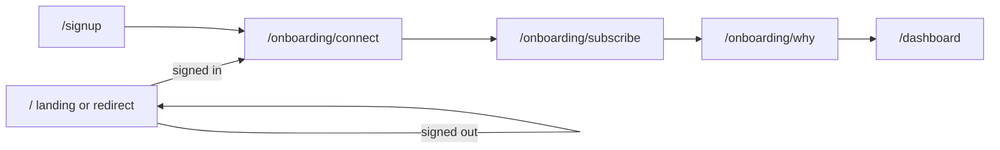

# Qapital Atlas — context, APIs, and flow

Single reference for what the app is, how data moves, and how users move through onboarding.

## Product context

**Qapital Atlas** is a prototype web app for a calm money-direction experience: net worth, pace, and a few high-signal focus areas—without turning into a line-by-line spend tracker. In this build, bank linking and some backend behavior are **simulated** in the browser (MSW) or via a **minimal Node billing server** for Adyen when configured.

**Tech stack:** React 19, TypeScript, Vite 7, React Router 7, MSW 2 for dev APIs, optional Express billing server (`server/index.mjs`), Adyen Web Drop-in for subscription checkout when live keys are present.

---

## Routes (UI)

| Path | Purpose |
|------|---------|
| `/` | Marketing **landing** if signed out; otherwise redirects to the next onboarding step or dashboard |
| `/signup` | Create account (redirects here if already signed in to the correct step) |
| `/onboarding/connect` | Optional mock “link accounts” |
| `/onboarding/subscribe` | Choose plan + trial / Adyen checkout |
| `/onboarding/why` | Primary reason selection |
| `/dashboard` | Insights summary (requires completed onboarding) |

Unknown paths redirect to `/`.

---

## Session model (client)

Session is stored in **localStorage** under `atlas_v2` as JSON (`AppSession`).

| Field | Meaning |
|-------|---------|
| `userId`, `token`, `email` | From registration |
| `onboardingStep` | `connect` → `subscribe` → `reasons` → `complete` |
| `primaryReasonId` | Selected reason id after reasons step |
| `accountsLinked` | Whether user chose mock link vs skip |
| `subscriptionPlan`, `subscriptionStatus`, `trialEndsAt` | After subscribe confirmation |

**Resume behavior:** `nextOnboardingPath(session)` maps `onboardingStep` to the correct path so returning users skip finished steps.

---

## User flow (onboarding)



1. **Sign up** — `POST` registration; session defaults to `onboardingStep: 'connect'`.
2. **Connect** — User links (mock) or skips → step becomes `subscribe`.
3. **Subscribe** — Billing session + confirm trial subscription → step becomes `reasons`.
4. **Why** — Saves primary reason → step becomes `complete` → **Dashboard**.

---

## API surface

All browser calls use the `/api` prefix. Shapes are defined in `src/mocks/apiLogic.ts` (shared types and mock implementation).

### Authentication

Protected routes expect:

```http
Authorization: Bearer <token>
```

### Endpoints

#### `POST /api/auth/register`

**Body:** `{ "email": string, "password": string }`  
**Response (201):** `{ userId, token, email }`

#### `POST /api/onboarding/primary-reason`

**Headers:** Bearer token  
**Body:** `{ "reasonId": string }`  
**Response:** `{ ok: true, reasonId }` (mock shape)

#### `POST /api/accounts/link`

**Headers:** Bearer token  
**Body:** `{ "action": "link" | "skip" }`  
**Response:** `{ accountsLinked: boolean, linkedAt: string | null }`

#### `GET /api/insights/summary`

**Headers:** Bearer token  
**Response:** `InsightsSummary` — `asOf`, `netWorth`, `netWorthChange12mPct`, `headline`, `focusAreas[]`, `netWorthSeries[]`

#### `POST /api/billing/adyen/session`

**Headers:** Bearer token  
**Body:** `{ "plan": "monthly" | "annual", "userId": string, "email": string }`  
**Response:** Discriminated union:

- **Mock:** `{ mode: "mock", plan, message }`
- **Live:** `{ mode: "live", id, sessionData, clientKey, environment, returnUrl }`

#### `POST /api/billing/adyen/confirm`

**Headers:** Bearer token  
**Body:** `{ "plan", "userId", "paymentReference?" }`  
**Response:** `{ ok: true, subscriptionStatus: "trialing", trialEndsAt, plan }`

#### `POST /api/billing/adyen/webhook` (server only)

Adyen webhook receiver; raw JSON body + optional `HmacSignature` verification. Returns `[accepted]`.

---

## How requests are handled (dev vs build)

| Mode | Behavior |
|------|----------|
| **Vite dev** (`import.meta.env.DEV`) | `src/api/client.ts` uses **fetch** to `/api/*`. **MSW** intercepts in the browser (`src/mocks/handlers.ts`). |
| **Production build** | Same client module calls **`apiLogic` in-process** (no HTTP) for register, onboarding, insights, and billing helpers—unless you change that pattern. |

**Billing passthrough:** If `VITE_USE_BILLING_API=true`, MSW does **not** mock `/api/billing/*`; requests pass through to the Vite **proxy**. Vite proxies `/api/billing` to `http://127.0.0.1:3001` (`vite.config.ts`). Run `npm run server` to start `server/index.mjs`.

**Node billing server** (`server/index.mjs`):

- Implements `/api/billing/adyen/session`, `/api/billing/adyen/confirm`, `/api/billing/adyen/webhook`.
- Without `ADYEN_API_KEY`, `ADYEN_MERCHANT_ACCOUNT`, and `ADYEN_CLIENT_KEY`, session returns the same **mock** shape as MSW.
- With keys, creates real Adyen Checkout **sessions** against `ADYEN_CHECKOUT_HOST` (default test checkout host).
- Env reference: `.env.example`.

---

## Local development

```bash
npm install
npm run dev          # Vite at http://localhost:5173 (typical)
```

Optional real billing path:

```bash
# .env: VITE_USE_BILLING_API=true, plus server env from .env.example
npm run server       # Express on PORT or 3001
npm run dev
```

---

## Related files

| Area | Location |
|------|----------|
| Routes | `src/App.tsx` |
| Session / steps | `src/lib/session.ts`, `src/lib/redirects.ts` |
| HTTP client | `src/api/client.ts` |
| Types + mock logic | `src/mocks/apiLogic.ts` |
| MSW handlers | `src/mocks/handlers.ts` |
| Billing server | `server/index.mjs` |
| Pricing constants | `src/lib/pricing.ts` |

---

## Mobile

A separate React Native app lives under `mobile/` with screens aligned to the same conceptual flow (signup → connect → subscribe → reasons → dashboard); it uses its own session and mock API copies—see that package for mobile-specific behavior.
